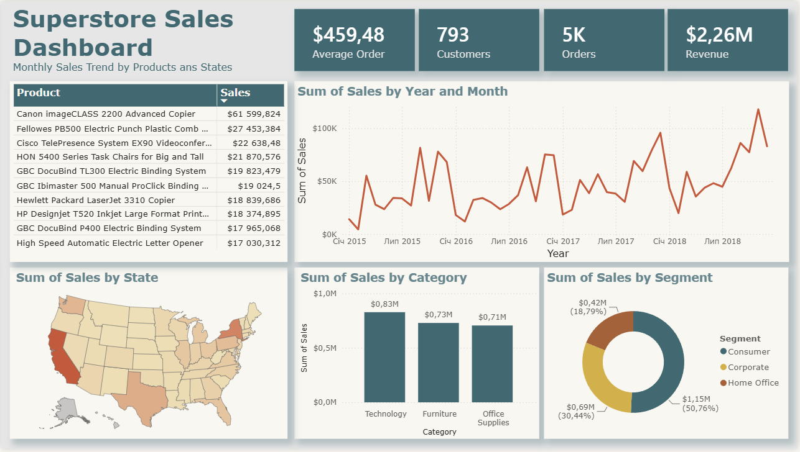

# Superstore Sales Analysis

## Overview

This project demonstrates an end-to-end data analysis workflow using the Superstore sales dataset. It covers data cleaning, exploratory data analysis (EDA), SQL analysis in PostgreSQL, and an interactive Power BI dashboard.

---

## Dataset

The dataset contains retail sales transactions from a U.S. office supplies company. Each record represents a single product purchased within a customer order and includes:

- Order and shipping information
- Customer and segment details
- Geographic data
- Product information
- Sales

---

## Project Structure

```
Superstore-Sales-Analysis/
│
├── data/
│   ├── raw/
│   └── processed/
│
├── notebooks/
│   ├── 01_data_loading.ipynb
│   ├── 02_data_cleaning.ipynb
│   └── 03_eda.ipynb
│
├── sql/
│   ├── 01_basic_queries.sql
│   ├── 02_business_questions.sql
│   └── 03_time_analysis.sql
│
├── dashboard/
│   └── SSA_dashboard.pbix
│
├── images/
├── README.md
├── .env.example
└── requirements.txt
```

---

## Notebooks

| Notebook | Description |
|----------|-------------|
| **01_data_loading.ipynb** | Initial data inspection, data types, missing values, duplicates, and descriptive statistics. |
| **02_data_cleaning.ipynb** | Data preprocessing, missing value handling, date conversion, outlier detection, and PostgreSQL export. |
| **03_eda.ipynb** | Exploratory analysis with visualizations and business insights. |

---

## SQL

The `sql` directory contains PostgreSQL queries covering:

- Basic SQL operations
- Business-oriented analysis
- Time-based sales analysis

---

## Power BI Dashboard

Interactive dashboard with:

- KPI cards (Revenue, Orders, Customers, Average Order Value)
- Monthly sales trend
- Top products
- Sales by category
- Sales by segment
- Sales by state

### Dashboard Preview



---

## Technologies

- Python
- Pandas
- NumPy
- Matplotlib
- PostgreSQL
- SQLAlchemy
- SQL
- Power BI
- JupyterLab

---

## Overall Findings

The analysis revealed several important business insights:

- **Technology** is the highest-performing product category, generating the largest share of revenue.
- Sales exhibit **clear seasonality**, with the strongest performance in **September, November, and December**.
- **Consumer** is the largest customer segment, while **Home Office** contributes the least.
- **New York City** and **California** are among the strongest-performing locations in terms of sales.
- High-value transactions are primarily associated with premium technology products and represent legitimate business activity rather than data quality issues.